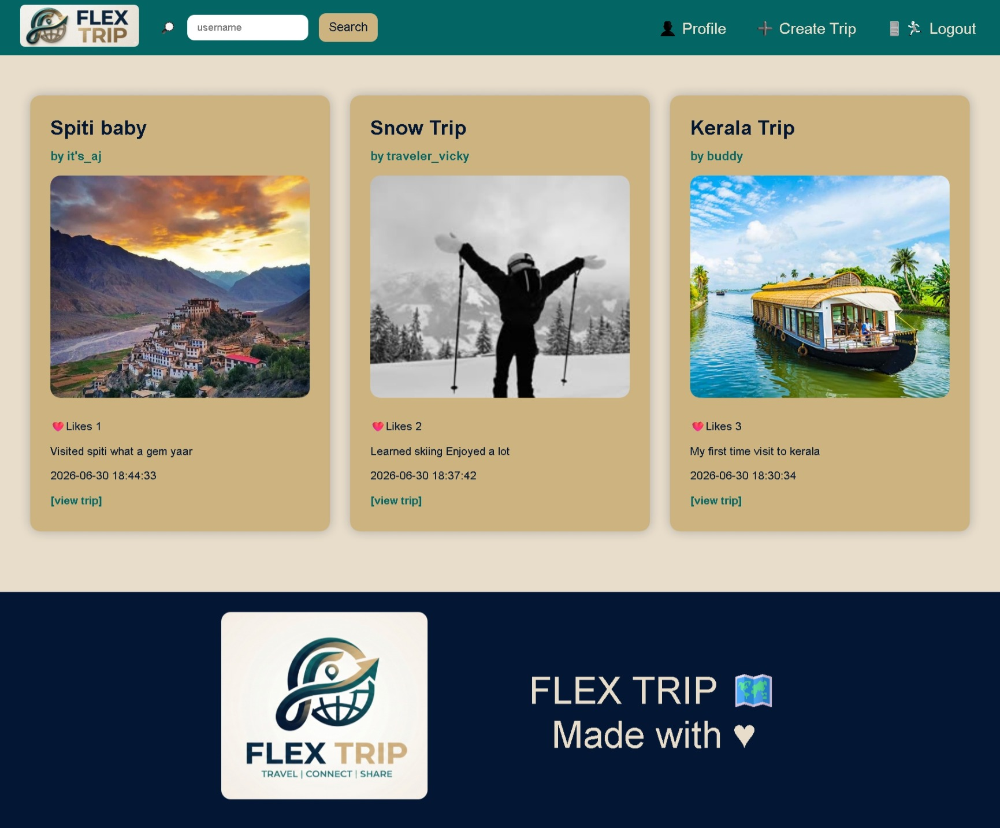
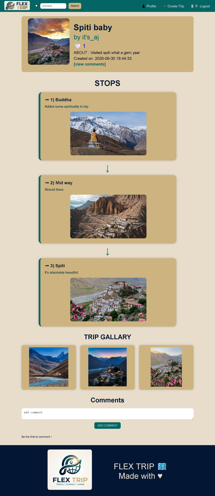
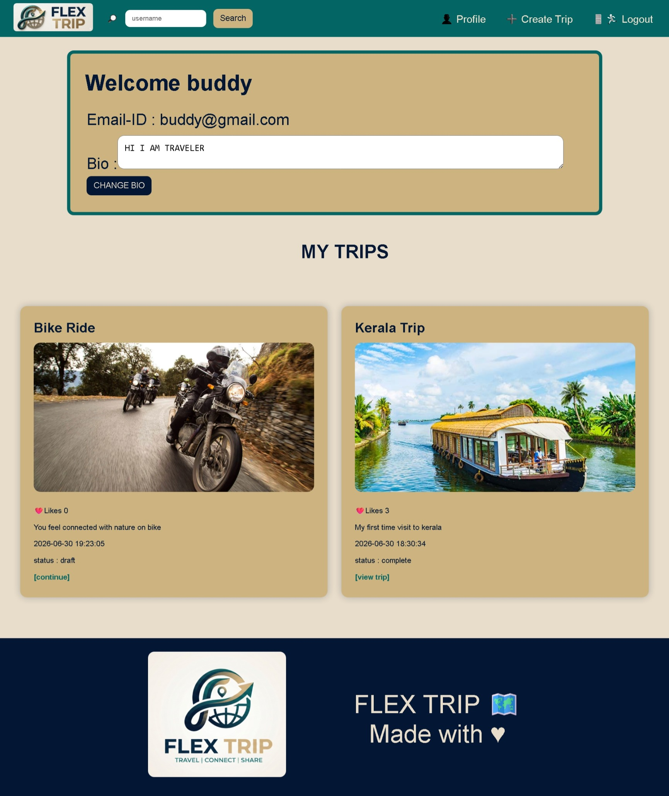
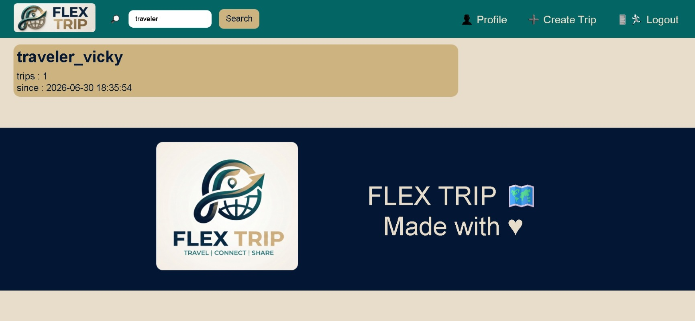
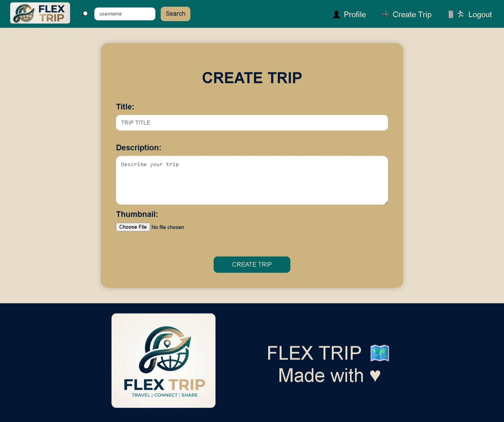

# 🌍 Flex Trip

A full-stack travel social media web application where users can share their travel experiences, create trips with multiple stops, upload gallery photos, interact with other travelers, and discover new travel destinations.

---

## Live Demo

🌐 https://flex-trip.onrender.com

## 📸 Screenshots

### Feed


### Trip Details


### User Profile


### Search Users


### Create Trip


---

## ✨ Features

- 🔐 User Authentication (Signup/Login)
- 👤 Public User Profiles
- 📝 Create and Publish Trips
- 📍 Add Multiple Stops to a Trip
- 🖼 Upload Trip Gallery Photos
- ❤️ Like Trips
- 💬 Comment on Trips
- 🔎 Search Users
- 📰 Travel Feed
- 📱 Clean Responsive UI
- 🔒 Password Hashing
- 🗃 MySQL Database

---

## 🛠 Tech Stack

### Frontend

- HTML
- CSS
- JavaScript

### Backend

- Flask
- Python

### Database

- MySQL

### Other

- Jinja2
- Werkzeug
- Git
- GitHub

---

## 📂 Project Structure

```
Flex-Trip/
│
├── static/
│   ├── css/
│   └── uploads/
│
├── templates/
│
├── app.py
├── db.py
├── flex_trip_database.sql
├── requirements.txt
├── README.md
└── .gitignore
```

---

## 🚀 Installation

Clone the repository

```bash
git clone https://github.com/Pravin-4593/Flex-Trip.git
```

Move into the project

```bash
cd Flex-Trip
```

Create a virtual environment

```bash
python -m venv env
```

Activate it

### Windows

```bash
env\Scripts\activate
```

### Linux / macOS

```bash
source env/bin/activate
```

Install dependencies

```bash
pip install -r requirements.txt
```

---

## ⚙ Environment Variables

Create a `.env` file in the project root.

```env
DB_HOST=localhost
DB_USER=your_username
DB_PASSWORD=your_password
DB_NAME=your_database

SECRET_KEY=your_secret_key
```

---

## 🗄 Database Setup

Create a MySQL database.

Import the provided SQL file.

```sql
SOURCE flex_trip_database.sql;
```

---

## ▶ Run the Application

```bash
python app.py
```

Open

```
http://127.0.0.1:5000
```

---

## 📌 Future Improvements

- Profile Pictures
- Notifications
- Follow Users
- Save Trips
- Interactive Maps
- Trip Editing
- Email Verification

---

## 👨‍💻 Author

**Pravin**

GitHub:
https://github.com/Pravin-4593

---

## 📄 License later
