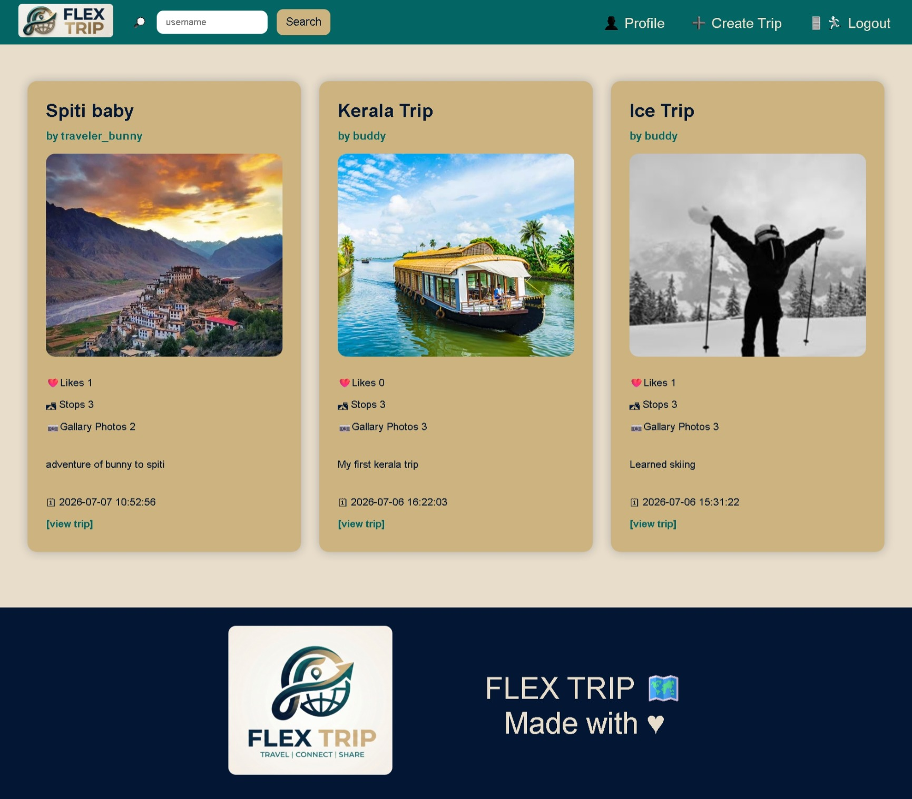
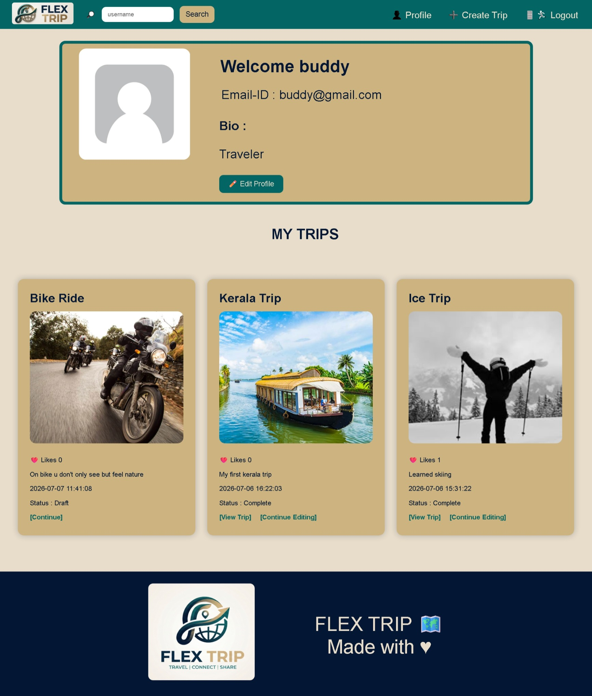
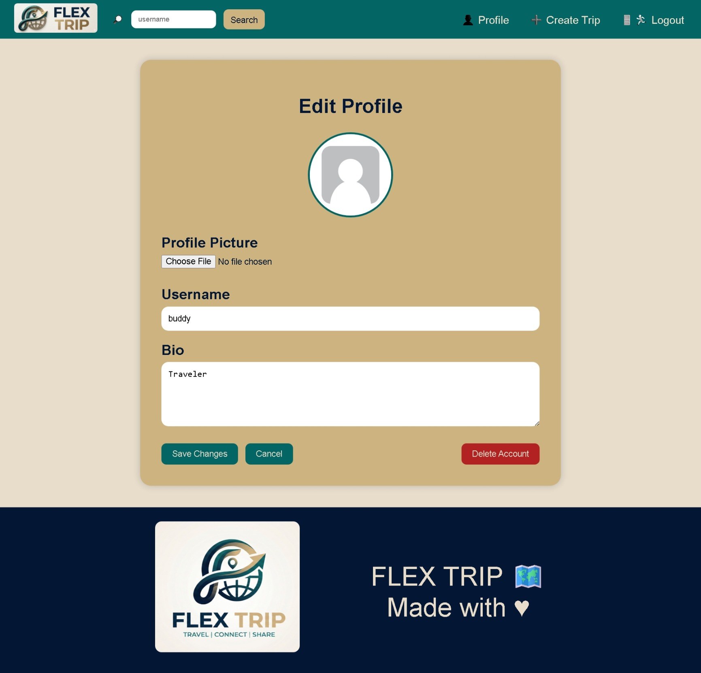
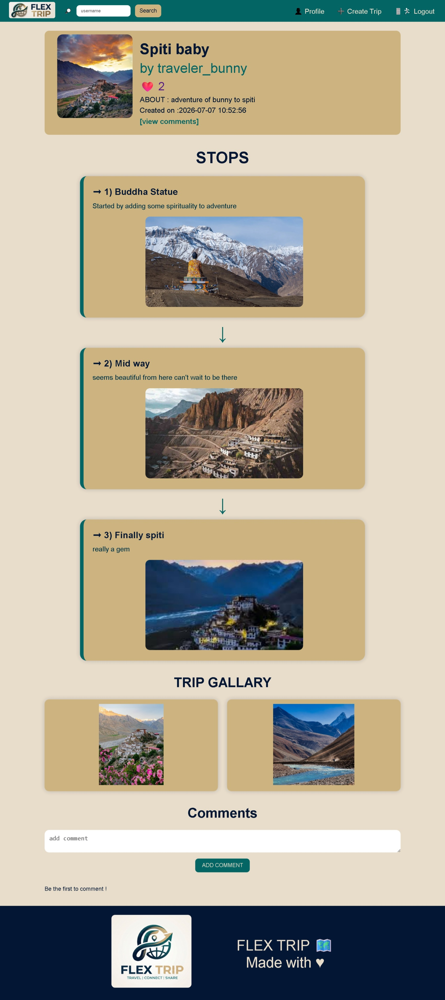
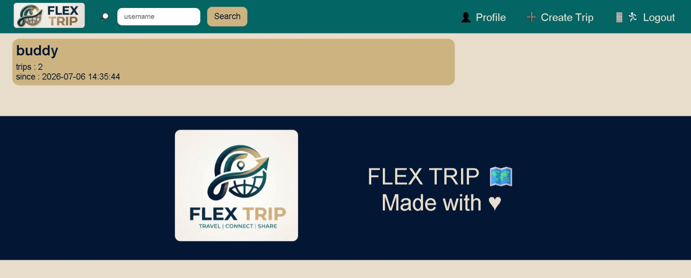
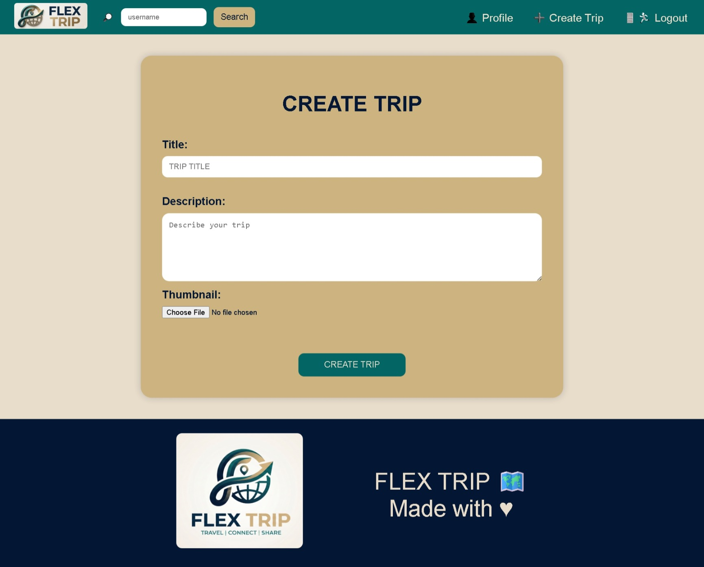
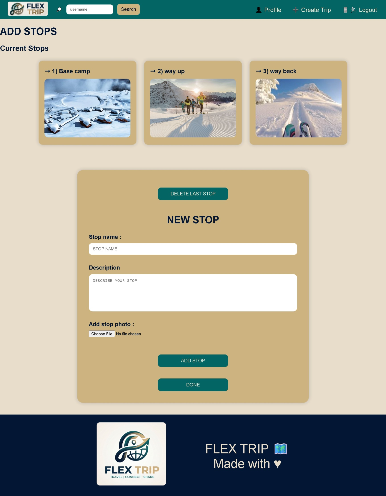
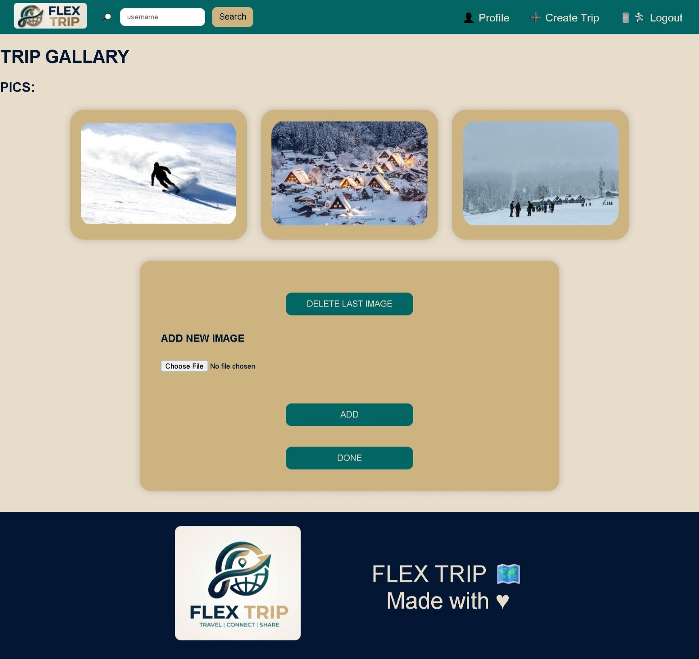

# 🌍 Flex Trip

A full-stack travel social media web application where users can share their travel experiences, create detailed trips with multiple stops, upload travel photos, interact with other travelers, and discover new adventures.

---

## 🌐 Live Demo

🔗 **[Flex Trip Live](https://flex-trip.onrender.com)**

---

## 🚀 Highlights

- Full-stack Flask web application
- Cloudinary image storage
- MySQL relational database
- Responsive UI
- Authentication & profile management
- Deployed on Render with Aiven Cloud Database

## 📸 Screenshots

### Feed


### User Profile


### Edit Profile


### Trip Details


### Search Users


### Create Trip


### Add Stops


### add gallery photos


---

## ✨ Features

### Authentication
- 🔐 User Signup & Login
- 🚪 Secure Logout
- 🔒 Password Hashing using Werkzeug
- 👤 Account Deletion

### User Profiles
- 👤 Public User Profiles
- 🖼 Profile Pictures
- ✏ Edit Profile (Bio & Profile Picture)
- 👥 View Other Travelers' Profiles

### Trip Management
- 📝 Create Trips
- 📍 Add Multiple Stops
- 🖼 Upload Trip Gallery
- ✏ Continue Editing Draft Trips
- 🗑 Delete Trips

### Social Features
- ❤️ Like Trips
- 💬 Comment on Trips
- 🔎 Search Users
- 📰 Travel Feed

### Media
- ☁ Cloudinary Image Storage
- 📷 Trip Thumbnails
- 📍 Stop Photos
- 🖼 Gallery Photos
- 👤 Profile Pictures

### Other
- 📱 Responsive Design
- 🗃 MySQL Database
- ☁ Cloud Hosted Database
- 🚀 Deployed on Render

---

## 🛠 Tech Stack

### Frontend
- HTML5
- CSS3
- JavaScript
- Jinja2

### Backend
- Python
- Flask

### Database
- MySQL (Aiven Cloud)

### Cloud Storage
- Cloudinary

### Deployment
- Render

### Tools
- Git
- GitHub

---

## 📂 Project Structure

```text
Flex-Trip/
│
├── routes/
│   ├── auth.py
│   ├── profile.py
│   ├── social.py
│   ├── trip.py
│   └── __init__.py
│
├── static/
│   ├── css/
│   ├── images/
│   └── ...
│
├── templates/
│
├── app.py
├── db.py
├── utils.py
├── cloudinary_config.py
├── flex_trip_database.sql
├── requirements.txt
├── README.md
└── .gitignore
```

---

## 🚀 Installation

Clone the repository

```bash
git clone https://github.com/Pravin-4593/Flex-Trip.git
```

Move into the project

```bash
cd Flex-Trip
```

Create a virtual environment

```bash
python -m venv env
```

Activate it

### Windows

```bash
env\Scripts\activate
```

### Linux / macOS

```bash
source env/bin/activate
```

Install dependencies

```bash
pip install -r requirements.txt
```

---

## ⚙ Environment Variables

Create a `.env` file in the project root.

```env
DB_HOST=your_database_host
DB_USER=your_database_username
DB_PASSWORD=your_database_password
DB_NAME=your_database_name

SECRET_KEY=your_secret_key

CLOUDINARY_CLOUD_NAME=your_cloud_name
CLOUDINARY_API_KEY=your_api_key
CLOUDINARY_API_SECRET=your_api_secret
```

---

## 🗄 Database Setup

Create a MySQL database and import the schema.

```sql
SOURCE flex_trip_database.sql;
```

---

## ▶ Run the Application

```bash
python app.py
```

Open:

```
http://127.0.0.1:5000
```

---

## 🚧 Future Improvements

- 📧 Email Verification
- 🔑 Forgot Password
- 👥 Follow / Unfollow Users
- 📰 Personalized Feed
- 🔔 Notifications
- 🗺 Interactive Maps
- 📌 Save Trips
- ❤️ Delete Comments
- 📄 Pagination

---

## 👨‍💻 Author

**Pravin**

GitHub:  
https://github.com/Pravin-4593

---

## 📄 License

This project is currently intended for educational and portfolio purposes.